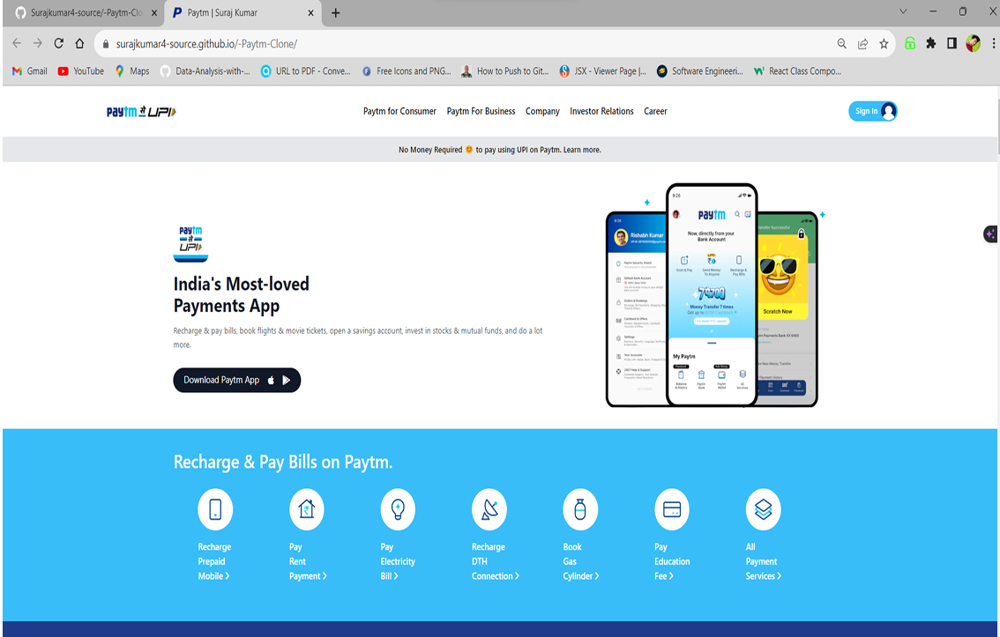

# Paytm UI Clone

## Overview

This is a Paytm UI Clone, a simple web application built with HTML, CSS, and Tailwind (CSS Framework) to replicate some features of the Paytm platform. It includes a responsive design, a navigation bar, and sections for recharging, bill payments, and booking various services.

## Table of Contents

- [Features](#features)
- [Usage](#usage)
- [Project Structure](#project-structure)
- [Contributing](#contributing)
- [License](#license)
- [Live_Link](#Live_Link)

## Features

- Responsive design for various screen sizes.
- Navigation bar with links to different sections.
- Sections for recharging mobile, paying bills, and booking services.
- Beautifully designed icons and images.

## Usage

Explore the different sections of the Paytm Clone, such as recharging your mobile, paying bills, and booking movie tickets. Please note that this is a clone for educational purposes and does not have real payment functionality.

## Project Structure

- `index.html`: The main HTML file containing the structure of the Paytm Clone.
- `style.css`: The stylesheet file for styling the HTML elements.
- `Assets/`: The folder containing images and icons used in the Paytm Clone.

### Some of screen-shots of my paytm-clone website.

## Contributing

Feel free to contribute to the project by opening issues or submitting pull requests. Your feedback and contributions are highly appreciated.

## License

This project is licensed under the MIT License - see the [LICENSE](LICENSE) file for details.

## Live_Link   
https://antiperiodic-delimi.000webhostapp.com/
